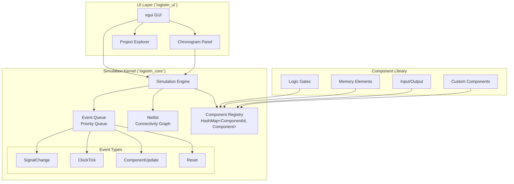
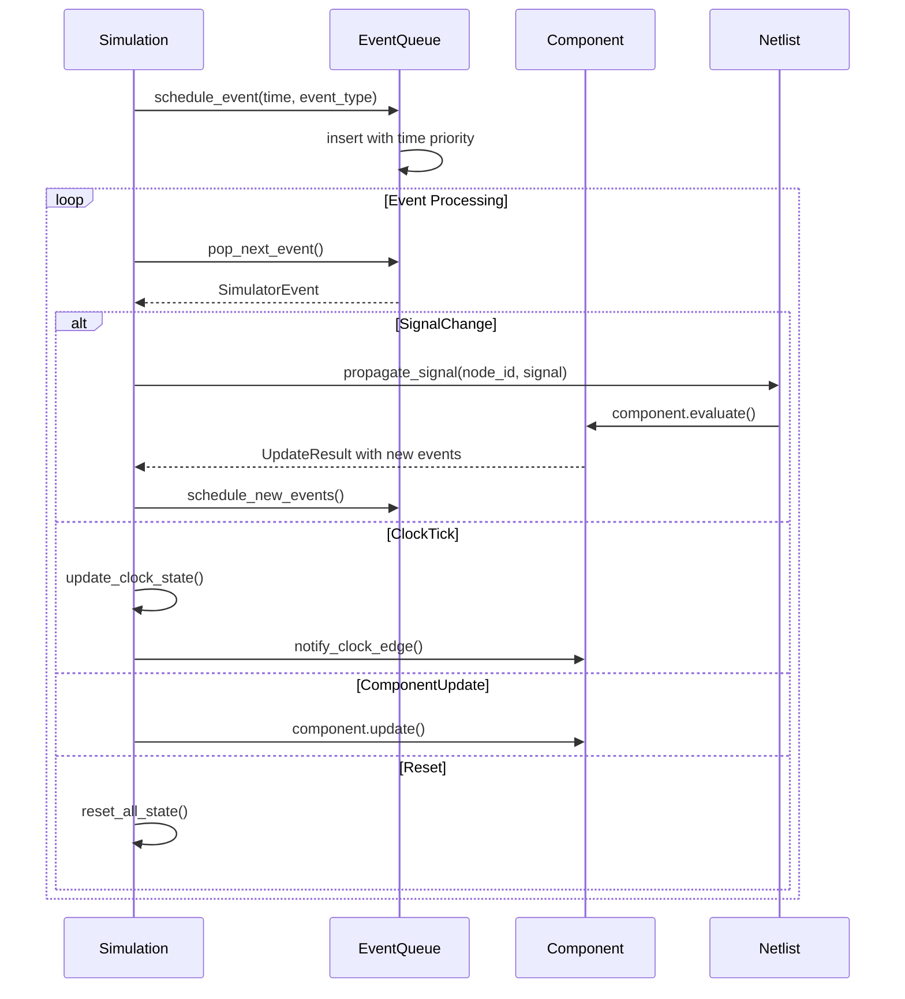
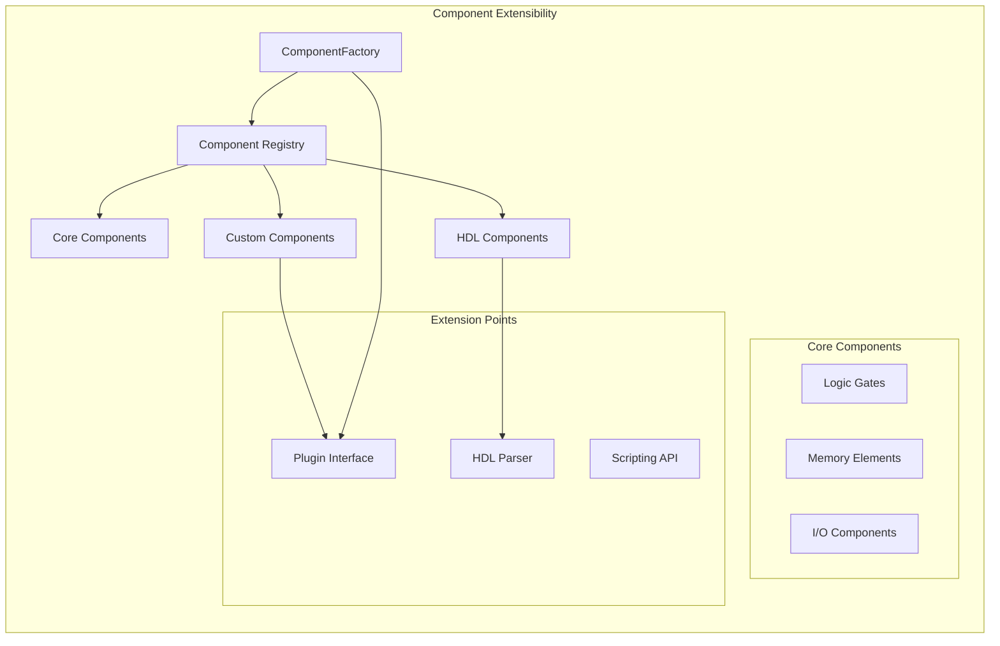

# Logisim-RUST Architecture

This document describes the architecture of the Logisim-RUST project, which is a Rust implementation of the Logisim-Evolution digital logic simulator.

## Overview

The project is organized into several crates, each with specific responsibilities:

- `logisim_core`: Core simulation engine and circuit representation
- `logisim_ui`: User interface components using egui
- Example schematics and test circuits are provided in `example_schematics/`

## Core Architecture (`logisim_core`)

### Foundation Infrastructure

#### Utility Classes (`logisim_core/src/util/`)
The utility module provides essential helper functions and data structures:

- **StringUtil & StringGetter**: Trait-based string handling with hex conversion, null checking, and text resizing operations
- **CollectionUtil**: Type-safe collection operations for Vec, HashMap, HashSet with union types and null-safe operations  
- **Cache**: Generic caching system with configurable sizing and string interning capabilities for performance optimization
- **FileUtil**: Cross-platform file operations with temporary file management and comprehensive I/O utilities
- **LocaleManager**: Internationalization system with string getter patterns and locale switching support

#### Core Data Structures (`logisim_core/src/data/`)
The data module contains fundamental types used throughout the system:

- **Direction**: Four cardinal directions (North, South, East, West) with rotation logic, degree/radian conversion, and display formatting
- **Location**: Immutable 2D coordinate system with grid snapping, Manhattan distance calculations, and spatial operations
- **Bounds**: Immutable rectangular bounding box with union/intersection operations, collision detection, and rotation support
- **BitWidth**: Enhanced bit width system with UI integration, mask generation, and compatibility with existing BusWidth types
- **Attribute System**: Complete type-safe component configuration system with generics, validation, and standard attributes for component properties

#### Component Framework (`logisim_core/src/components/`)
Prepared structure for component implementations:

- **Base Module**: Foundation for component implementations with proper module organization
- **Extensible Architecture**: Ready for systematic addition of gates, memory, I/O, and specialized components

### Circuit Representation
- **Circuit Format (.circ)**: XML-based format for storing circuit designs
- **Netlist**: Represents the connectivity between components
- **Components**: Individual logic elements (gates, latches, etc.)
- **Signals**: Digital values and timing information

### Simulation Engine
- **Event-driven simulation**: Uses an event queue to process signal changes
- **Component abstraction**: Generic trait for all circuit components
- **Time-based simulation**: Supports precise timing simulation

## Simulation Kernel Control Flow

### Overview

The Logisim-RUST simulation kernel is built around an event-driven architecture that provides deterministic, time-ordered execution of digital logic simulation. The kernel operates through discrete time steps, processing events that represent signal changes, component updates, and clock ticks.

### Core Architecture Diagram



### Crate/Module Boundaries

#### `logisim_core` - Simulation Kernel
The core simulation engine with clearly defined module responsibilities:

```rust
// Core simulation types and orchestration
mod simulation {
    pub struct Simulation;          // Main simulation engine
    pub struct SimulationConfig;    // Runtime configuration
    pub struct SimulationStats;     // Performance metrics
    pub enum SimulationError;       // Error handling
}

// Event processing and scheduling
mod event {
    pub struct EventQueue;          // Priority queue for events
    pub struct SimulatorEvent;      // Individual simulation events
    pub enum EventType;             // Event type classification
    pub struct EventId;             // Unique event identification
}

// Network connectivity and signal routing
mod netlist {
    pub struct Netlist;             // Circuit connectivity graph
    pub struct Node;                // Connection points
    pub struct Net;                 // Signal nets (wires)
    pub struct Connection;          // Component-to-node connections
}

// Component abstraction and management
mod component {
    pub trait Component;            // Core component interface
    pub trait ComponentFactory;     // Component creation
    pub struct ComponentId;         // Unique component identification
}

// Signal representation and manipulation
mod signal {
    pub struct Signal;              // Digital signal values
    pub enum Value;                 // Logic values (High/Low/Unknown/Error)
    pub struct BusWidth;            // Multi-bit signal width
    pub struct Timestamp;           // Simulation time representation
}
```

#### `logisim_ui` - User Interface Layer
The UI layer provides visual interaction and monitoring:

```rust
// Main application framework
mod main_frame {
    pub struct MainFrame;           // Primary application window
    pub struct Canvas;              // Circuit editing canvas
    pub struct ToolManager;         // Tool selection and management
}

// Real-time simulation monitoring
mod chronogram {
    pub struct ChronogramPanel;     // Timing diagram display
    pub struct SignalTracker;       // Signal value recording
    pub struct Timeline;            // Time axis navigation
}

// Project and file management
mod project {
    pub struct ProjectExplorer;     // Circuit hierarchy navigation
    pub struct FileManager;         // File I/O operations
}
```

### Event Queue Processing

#### Event Scheduling and Prioritization

The simulation kernel uses a binary heap-based priority queue to ensure events are processed in strict time order:



#### Event Processing Cycle

1. **Event Retrieval**: Pop the earliest event from the priority queue
2. **Time Advancement**: Update simulation time to event timestamp
3. **Event Dispatch**: Route event to appropriate handler based on type
4. **Component Evaluation**: Execute component logic for signal changes
5. **Signal Propagation**: Update netlist with new signal values
6. **Callback Notification**: Trigger external observers (chronogram, UI)
7. **Event Generation**: Schedule new events from component outputs

### Component Integration and Extensibility Points

#### Component Trait Definition

All simulation components implement the core `Component` trait:

```rust
pub trait Component: Send + Sync {
    /// Unique identifier for this component
    fn id(&self) -> ComponentId;
    
    /// Component type name for factory registration
    fn component_type(&self) -> &'static str;
    
    /// Process input signals and generate outputs
    fn evaluate(&mut self, inputs: &HashMap<String, Signal>) -> UpdateResult;
    
    /// Handle clock edge events for sequential components
    fn on_clock_edge(&mut self, edge: ClockEdge) -> UpdateResult;
    
    /// Reset component to initial state
    fn reset(&mut self);
    
    /// Get component's input/output pin definitions
    fn get_pins(&self) -> Vec<Pin>;
    
    /// Handle attribute changes (width, delay, etc.)
    fn configure(&mut self, attributes: &AttributeSet);
}
```

#### Extensibility Architecture

The simulation kernel provides multiple extension points for new components:



#### Component Registration System

```rust
// Component factory registration
pub struct ComponentRegistry {
    factories: HashMap<String, Box<dyn ComponentFactory>>,
}

impl ComponentRegistry {
    pub fn register<F: ComponentFactory + 'static>(&mut self, factory: F) {
        self.factories.insert(factory.get_name(), Box::new(factory));
    }
    
    pub fn create_component(&self, component_type: &str) -> Option<Box<dyn Component>> {
        self.factories.get(component_type)?.create_component().into()
    }
}
```

### Performance Optimization Strategies

#### Memory Management
- **Component Pooling**: Reuse component instances to reduce allocations
- **Event Batching**: Process multiple events at the same timestamp together
- **Signal Interning**: Cache frequently used signal values
- **Sparse Event Storage**: Only store events that actually occur

#### Parallel Processing Opportunities
- **Component Evaluation**: Independent components can be evaluated in parallel
- **Signal Propagation**: Non-interdependent signal paths can be processed concurrently
- **Event Processing**: Future events can be pre-computed while current events execute

### Debugging and Introspection

The simulation kernel provides comprehensive debugging facilities:

```rust
pub struct SimulationDebugger {
    pub event_trace: Vec<SimulatorEvent>,
    pub signal_history: HashMap<NodeId, Vec<(Timestamp, Signal)>>,
    pub component_states: HashMap<ComponentId, Box<dyn ComponentState>>,
    pub performance_metrics: SimulationStats,
}
```

#### Debug Output Example
```
[T=100] Processing ClockTick event
[T=100] Clock edge: Rising
[T=100] Component AND_GATE_1 evaluating inputs: A=High, B=High
[T=100] Component AND_GATE_1 output Y -> High
[T=101] Scheduling SignalChange event for node N3
[T=101] Signal propagation to 3 connected components
```

### Key Modules
- `circ_format.rs`: Circuit file parsing and serialization
- `simulation.rs`: Main simulation engine
- `netlist.rs`: Network connectivity management
- `signal.rs`: Signal and value representations
- `component.rs`: Component trait and implementations

## User Interface (`logisim_ui`)

### GUI Framework
The UI is built using **egui**, a modern immediate-mode GUI framework for Rust that provides:
- Cross-platform compatibility
- High performance rendering
- Integration with wgpu/OpenGL backends

### Main Components
- **MainFrame**: Primary application window
- **Canvas**: Circuit editing and display area
- **Toolbox**: Component palette
- **ProjectExplorer**: Circuit hierarchy navigation
- **ChronogramPanel**: Timing diagram display

## Chronogram (Waveform/Timing View) Feature

### Overview
The chronogram feature provides timing diagram visualization, equivalent to the Java Logisim-Evolution's chronogram functionality. It displays signal states over time for wires, buses, and components.

### Architecture

#### Module Structure
```
logisim_ui/src/gui/chronogram/
├── mod.rs          # Module exports and constants
├── model.rs        # Data model for signal tracking
├── panel.rs        # Main chronogram UI panel
├── timeline.rs     # Time axis and navigation
└── waveform.rs     # Signal waveform rendering
```

#### Key Components

##### ChronogramModel (`model.rs`)
- **SignalInfo**: Metadata about tracked signals (name, width, selection state)
- **SignalData**: Time-series data for signal value changes
- **ChronogramModel**: Main data container managing all signals and timing

Features:
- Efficient signal value storage using `BTreeMap<Timestamp, Signal>`
- Support for single-bit and multi-bit (bus) signals
- Time range tracking and cursor positioning
- Signal selection management

##### Timeline (`timeline.rs`)
- Time axis rendering with automatic tick spacing
- Zoom and scroll navigation
- Cursor positioning and time marker display
- Interactive time selection

Features:
- Automatic "nice" interval calculation for tick marks
- Pixel-to-time coordinate conversion
- Zoom limits and smooth zooming around cursor position
- Horizontal scrolling for long simulations

##### Waveform (`waveform.rs`)
- Individual signal waveform rendering
- Support for digital signals and bus values
- Color-coded value representation
- Text labels for bus values

Features:
- Digital signal rendering (high/low/unknown/error states)
- Bus signal rendering with hex/decimal value display
- Transition edge visualization
- Customizable color schemes
- Selection highlighting

##### ChronogramPanel (`panel.rs`)
- Main UI panel integrating all components
- Signal list display with current values
- Recording control and simulation integration
- Export functionality

Features:
- Splitter between signal names and waveforms
- Signal selection dialog
- Toolbar with zoom, recording, and export controls
- Real-time update during simulation
- Text export of waveform data

### Integration with Simulation

#### Signal Capture
The chronogram integrates with the simulation engine through:
1. **Automatic signal discovery**: Extracts all nodes from the netlist
2. **Real-time monitoring**: Updates signal values during simulation steps
3. **Callback system** (planned): Direct notification of signal changes

#### Required Signals
Following the Java implementation, the chronogram requires:
- **sysclk**: System clock signal (mandatory)
- **clk**: Optional secondary clock
- Any user-selected signals from the circuit

### Usage

#### Basic Workflow
1. Load a circuit file containing clock signals
2. Open the chronogram via the "📊 Chronogram" button
3. Start simulation recording
4. Step or run the simulation to capture timing data
5. Use zoom/scroll to navigate the timing diagram
6. Export timing data if needed

#### Navigation Controls
- **Zoom**: Mouse wheel or toolbar buttons
- **Scroll**: Click and drag on timeline
- **Cursor**: Click on timeline to set time cursor
- **Signal Selection**: Click on signal names to highlight

### Export Capabilities

#### Text Export
The chronogram supports text export with:
- Time range information
- Signal count and names
- Timestamped value changes for each signal
- Human-readable format

#### Future Enhancements
- Image export (PNG/SVG)
- CSV format export
- Custom time range selection

### Performance Considerations

#### Memory Management
- Efficient storage using `BTreeMap` for sparse signal data
- Lazy waveform rendering only for visible time ranges
- Configurable maximum recording duration

#### Rendering Optimization
- Culling of off-screen waveforms
- Efficient timeline tick calculation
- Minimized redraw on zoom/scroll operations

### Testing

#### Unit Tests
Each module includes comprehensive unit tests:
- Signal data operations
- Timeline coordinate conversions
- Waveform value formatting
- Export functionality

#### Integration Tests
- Chronogram panel creation and lifecycle
- Simulation integration
- Signal recording and playback

### Compatibility with Java Implementation

The Rust chronogram implementation maintains compatibility with the Java Logisim-Evolution by:
- Following the same signal naming conventions (sysclk requirement)
- Using equivalent timing semantics
- Providing similar UI layout and controls
- Supporting the same export formats

### Configuration Constants

Key configuration values in `chronogram/mod.rs`:
```rust
pub const SIGNAL_HEIGHT: f32 = 30.0;      // Height of each waveform
pub const HEADER_HEIGHT: f32 = 20.0;       // Timeline header height
pub const GAP: f32 = 2.0;                  // Gap between traces
pub const DEFAULT_TICK_WIDTH: f32 = 10.0;  // Default time scale
```

## Dependencies

### Core Dependencies
- `serde`: Serialization for circuit files
- `thiserror`: Error handling
- `quick-xml`: XML parsing
- `roxmltree`: XML tree processing

### UI Dependencies (feature-gated)
- `eframe`: egui application framework
- `egui`: Immediate mode GUI
- Graphics backends (automatically selected)

## Build Configuration

### Features
- `gui`: Enables GUI components (default)
- No GUI: Headless simulation mode for testing/automation

### Platform Support
- Windows, macOS, Linux desktop platforms
- Web assembly target (via eframe web backend)

## Testing Strategy

### Unit Tests
- Individual module functionality
- Algorithm correctness
- Error handling

### Integration Tests
- Cross-module interactions
- File format compatibility
- Simulation accuracy

### Example Circuits
- Comprehensive test suite using `example_schematics/`
- Verification against Java implementation behavior
- Performance benchmarking

## Future Enhancements

### Planned Features
- VHDL/Verilog export
- Advanced component library
- Plugin system
- Network simulation capabilities

### Performance Optimizations
- Multi-threaded simulation
- GPU acceleration for rendering
- Memory pool allocation

## Migration Roadmap

### Core Kernel Implementation Status

| Feature Area | Component | Status | Priority | Notes |
|--------------|-----------|--------|----------|-------|
| **Event System** | Event Queue | ✅ Complete | Critical | Priority queue with time ordering |
| | Event Types | ✅ Complete | Critical | SignalChange, ClockTick, ComponentUpdate, Reset |
| | Event Scheduling | ✅ Complete | Critical | Time-based event insertion and retrieval |
| **Simulation Engine** | Core Loop | ✅ Complete | Critical | Event processing and dispatch |
| | Statistics Tracking | ✅ Complete | Medium | Performance metrics collection |
| | Configuration | ✅ Complete | Medium | Timeout, oscillation detection |
| | Error Handling | ✅ Complete | High | Comprehensive error types |
| **Component System** | Base Trait | ✅ Complete | Critical | Core Component interface |
| | Factory Pattern | ✅ Complete | Critical | Component creation abstraction |
| | Registry | 🚧 Partial | High | Component type registration |
| | Plugin Interface | ❌ Planned | Medium | Dynamic component loading |

### Netlist Handling Implementation Status

| Feature Area | Component | Status | Priority | Notes |
|--------------|-----------|--------|----------|-------|
| **Graph Structure** | Node Management | ✅ Complete | Critical | Connection point representation |
| | Net Management | ✅ Complete | Critical | Wire/bus representation |
| | Connection Tracking | ✅ Complete | Critical | Component-to-node mapping |
| **Signal Routing** | Signal Propagation | ✅ Complete | Critical | Value propagation through nets |
| | Multi-bit Buses | ✅ Complete | High | Bus width handling |
| | Signal Conflicts | 🚧 Partial | High | Conflict resolution rules |
| **Optimization** | Sparse Representation | ✅ Complete | Medium | Efficient storage for large circuits |
| | Change Detection | ✅ Complete | Medium | Only propagate actual changes |
| | Cycle Detection | ❌ Planned | Low | Combinational loop detection |

### Extensibility Features Status

| Feature Area | Component | Status | Priority | Notes |
|--------------|-----------|--------|----------|-------|
| **Component Libraries** | Standard Gates | ✅ Complete | Critical | AND, OR, NOT, XOR, etc. |
| | Memory Elements | 🚧 Partial | High | Flip-flops, latches, RAM, ROM |
| | I/O Components | 🚧 Partial | High | Input pins, output pins, clocks |
| | Arithmetic Components | ❌ Planned | Medium | Adders, comparators, counters |
| **HDL Integration** | VHDL Parser | 🚧 Partial | Low | Basic VHDL entity parsing |
| | Verilog Support | ❌ Future | Low | Verilog module support |
| | BLIF Support | 🚧 Partial | Low | Berkeley Logic Interchange Format |
| **External Interfaces** | Plugin API | ❌ Planned | Medium | Dynamic library loading |
| | Scripting Support | ❌ Future | Low | Lua or Python scripting |
| | External Tools | ❌ Future | Low | Synthesis, place & route integration |

### Migration Priorities

**Phase 1 (Current - v1.0)**: Core simulation functionality
- ✅ Basic event-driven simulation
- ✅ Standard logic gates
- ✅ Circuit file loading
- ✅ UI integration

**Phase 2 (v1.1)**: Enhanced component library  
- 🚧 Complete memory elements
- 🚧 Advanced I/O components
- 🚧 Component registry system
- ❌ Signal conflict resolution

**Phase 3 (v1.2)**: Extensibility framework
- ❌ Plugin architecture
- ❌ HDL component integration
- ❌ Custom component API
- ❌ Performance optimizations

**Phase 4 (Future)**: Advanced features
- ❌ Multi-threaded simulation
- ❌ External tool integration
- ❌ Advanced debugging tools
- ❌ Web-based simulation

## Migration from Java

See `MIGRATION_NOTES.md` for detailed information about:
- API differences from Java implementation
- Porting guidelines for Java components
- Feature parity status
- Known limitations and workarounds