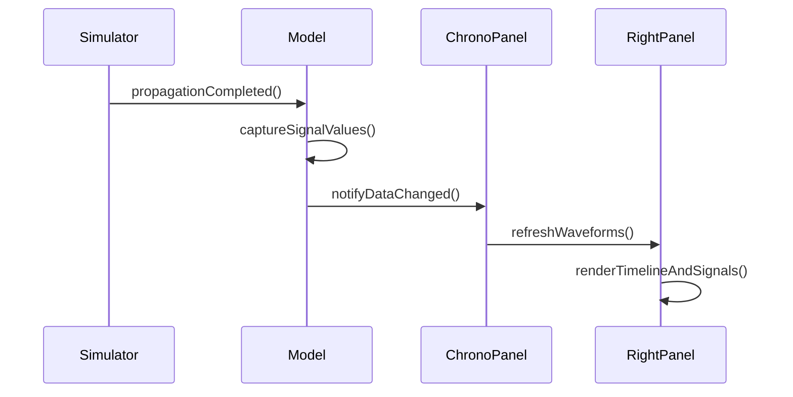
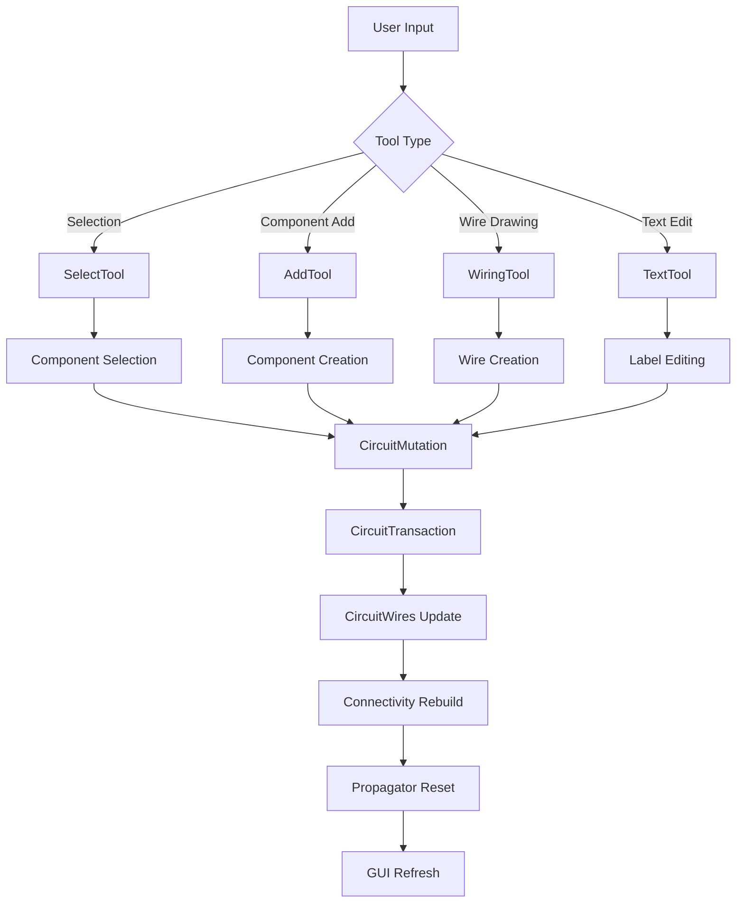
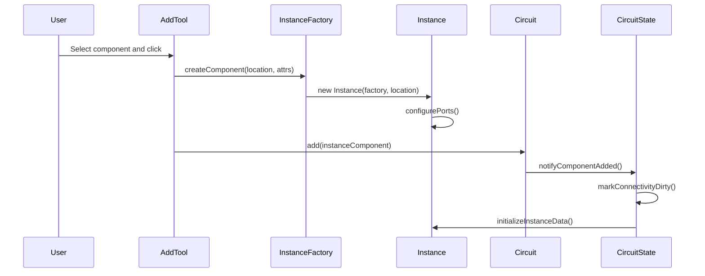
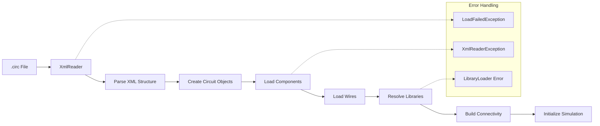
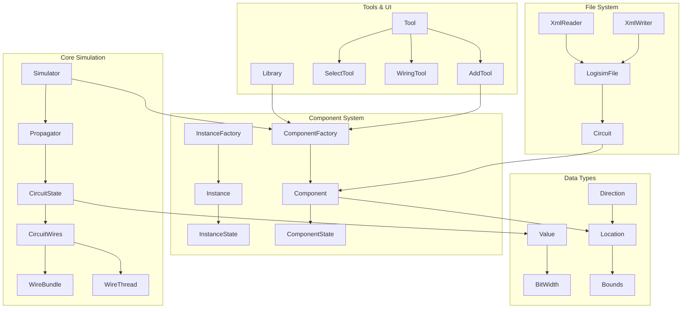

# Migration Notes: Java Logisim-Evolution to Rust

This document provides detailed notes about migrating from the Java Logisim-Evolution implementation to the Rust version, including the foundational infrastructure, simulation kernel, and features like the chronogram.

## Overview

The Rust port maintains API compatibility and behavioral equivalence with the Java implementation while leveraging Rust's memory safety and performance benefits.

## Java Simulation Kernel Class Enumeration

### Core Simulation Packages

The following packages form the heart of the Logisim-Evolution simulation engine:

#### Package: com.cburch.logisim.circuit
*Core simulation circuit management and netlist connectivity*

| Java Class | Type | Responsibility Summary |
|------------|------|------------------------|
| `CircuitWires` | class | **Central netlist manager**: Stores and calculates values propagated along all wires and buses. Manages WireBundle and WireThread connectivity for circuit netlist. |
| `Propagator` | class | **Event-driven simulation engine**: Manages event queue, component propagation, and timing. Contains SimulatorEvent for scheduling value changes. |
| `Simulator` | class | **Top-level simulation coordinator**: Controls ticking, stepping, auto-propagation. Manages simulation thread and provides listener interfaces. |
| `CircuitState` | class | **Simulation state container**: Holds values on wires/buses and component instance data. Manages dirty lists for incremental updates. |
| `Circuit` | class | **Circuit structure definition**: Contains components, wires, and circuit metadata. Provides circuit modification operations. |
| `WireBundle` | class | **Physical wire grouping**: Represents user-drawn wire segments as bundles of 1-32 bit threads. Handles width compatibility and pull values. |
| `WireThread` | class | **Electrical connectivity**: Single-bit electrically contiguous trace through circuit. Traverses splitters and multiple WireBundles. |
| `Wire` | class | **Individual wire component**: Basic wire element with endpoints. Provides visual representation and connectivity points. |
| `Splitter` | class | **Bus fan-out component**: Splits/joins buses of different widths. Central to multi-bit signal routing. |
| `PropagationPoints` | class | **Dirty tracking**: Manages locations and components needing recomputation during simulation steps. |

#### Package: com.cburch.logisim.data
*Fundamental data types and simulation values*

| Java Class | Type | Responsibility Summary |
|------------|------|------------------------|
| `Value` | class | **Digital signal values**: Represents multi-bit digital values with unknown/error states. Core of all signal propagation. |
| `BitWidth` | class | **Bus width representation**: Defines bit widths 1-32 with validation and compatibility checking. |
| `Location` | class | **Coordinate system**: Immutable 2D grid coordinates for component and wire positioning. |
| `Bounds` | class | **Spatial boundaries**: Immutable rectangular bounds for collision detection and graphics. |
| `Direction` | class | **Orientation management**: Four cardinal directions for component and wire orientation. |
| `AttributeSet` | interface | **Component configuration**: Manages component properties and configuration parameters. |

#### Package: com.cburch.logisim.comp
*Component framework and lifecycle management*

| Java Class | Type | Responsibility Summary |
|------------|------|------------------------|
| `Component` | interface | **Component abstraction**: Primary interface for all circuit components. Defines ports, behavior, and rendering. |
| `ComponentFactory` | interface | **Component creation**: Factory pattern for instantiating components with proper configuration. |
| `ComponentState` | interface | **Instance data storage**: Manages component-specific state data during simulation. |
| `EndData` | class | **Port definitions**: Describes component connection points with location, direction, and bit width. |

#### Package: com.cburch.logisim.std.wiring
*Wiring infrastructure components*

| Java Class | Type | Responsibility Summary |
|------------|------|------------------------|
| `Pin` | class | **I/O connection points**: Input/output pins for circuit interfaces. Provides pull-up/pull-down options. |
| `Clock` | class | **Timing source**: Generates clock signals with configurable frequency. Essential for sequential circuits. |
| `Tunnel` | class | **Long-distance connections**: Named tunnels for clean long-distance signal routing without visual wires. |
| `Constant` | class | **Fixed value sources**: Provides constant 0/1 values and multi-bit constants for circuit inputs. |
| `Ground` | class | **Ground reference**: Provides logical ground (0) reference for circuits. |
| `Power` | class | **Power reference**: Provides logical power (1) reference for circuits. |
| `PullResistor` | class | **Pull-up/down resistors**: Provides weak pull values for floating signals. |

### Wire/Net Construction and Update Flow

#### During Circuit Edits

```mermaid
graph TD
    A[User adds/removes wire] --> B[Circuit.fireMutation()]
    B --> C[CircuitWires.voidConnectivity()]
    C --> D[Connectivity recalculated]
    D --> E[WireBundle unification]
    E --> F[WireThread reassignment]
    F --> G[PropagationPoints marked dirty]
    G --> H[GUI refresh triggered]
```

**Key Steps:**
1. **Wire Addition**: New Wire component added to Circuit
2. **Connectivity Invalidation**: CircuitWires marks connectivity as void
3. **Bundle Reconstruction**: WireBundle objects unified at intersection points
4. **Thread Mapping**: WireThread objects traverse splitters to maintain electrical continuity
5. **Width Resolution**: BitWidth compatibility checked across connected components
6. **Dirty Marking**: All affected locations marked for recomputation

#### During Simulation Steps

```mermaid
graph TD
    A[Component produces new value] --> B[Propagator.scheduleEvent()]
    B --> C[SimulatorEvent queued]
    C --> D[Event processed by time]
    D --> E[CircuitWires.propagate()]
    E --> F[WireThread values updated]
    F --> G[Connected components triggered]
    G --> H[New events scheduled]
```

**Key Steps:**
1. **Value Change**: Component outputs new value at specific time
2. **Event Scheduling**: Propagator creates SimulatorEvent with timestamp
3. **Wire Propagation**: CircuitWires updates WireThread values
4. **Fanout**: Connected components receive new input values
5. **Cascade**: Components may schedule additional events
6. **Convergence**: Simulation continues until event queue empty

### Timing/Chronogram Analysis

#### Package: com.cburch.logisim.gui.chrono
*Chronogram timing visualization and waveform display*

| Java Class | Type | Responsibility Summary |
|------------|------|------------------------|
| `ChronoPanel` | class | **Main chronogram UI**: Split-pane panel containing signal list and waveform display. Coordinates timing visualization. |
| `LeftPanel` | class | **Signal list management**: Displays signal names, values, and selection controls. Handles signal configuration. |
| `RightPanel` | class | **Waveform rendering**: Renders timing diagrams with time axis and signal waveforms. Handles zoom/scroll. |

#### Package: com.cburch.logisim.gui.log
*Signal monitoring and data logging*

| Java Class | Type | Responsibility Summary |
|------------|------|------------------------|
| `Model` | class | **Data logging coordinator**: Manages signal capture, storage, and chronogram data model. Implements CircuitListener. |
| `Signal` | class | **Signal data storage**: Time-series signal value storage with efficient access patterns. |
| `SignalInfo` | class | **Signal metadata**: Signal configuration including radix, color, and display options. |
| `LogFrame` | class | **Logging window manager**: Top-level window for chronogram and logging functionality. |

#### Timing Computation Flow



**Key Components:**
1. **Signal Capture**: Model listens to Simulator events and captures signal values at each propagation
2. **Time Indexing**: Efficient time-based indexing for rapid waveform rendering
3. **Rendering Pipeline**: RightPanel renders visible time range with automatic level-of-detail
4. **Interactive Navigation**: Zoom/scroll with coordinate mapping between time and pixels

### Java-to-Rust Architecture Mapping

#### Core Simulation Translation

| Java Component | Rust Equivalent | Key Changes |
|----------------|-----------------|-------------|
| `CircuitWires` | `logisim_core::netlist` | Ownership-based connectivity, efficient updates |
| `Propagator` | `logisim_core::simulation` | Event queue with zero-copy scheduling |
| `CircuitState` | `logisim_core::simulation::State` | Borrowing instead of shared references |
| `Value` | `logisim_core::signal::Signal` | Stack-allocated values, bitwise operations |
| `WireBundle`/`WireThread` | `logisim_core::netlist::{Bundle,Thread}` | Union-find with path compression |

#### Chronogram Migration Status

| Java Class | Rust Module | Implementation Status |
|------------|-------------|----------------------|
| `ChronoPanel` | `logisim_ui::gui::chronogram::panel` | ✅ **Complete** - egui split panel |
| `LeftPanel` | `logisim_ui::gui::chronogram::panel` | ✅ **Complete** - signal list UI |
| `RightPanel` | `logisim_ui::gui::chronogram::{timeline,waveform}` | ✅ **Complete** - waveform rendering |
| `Model` | `logisim_ui::gui::chronogram::model` | ✅ **Complete** - data management |
| `Signal` | `logisim_ui::gui::chronogram::model` | ✅ **Complete** - time-series storage |

### Complete Java Class Reference

#### Extended Package Analysis

**com.cburch.logisim.instance** - *Component instance lifecycle and simplified component framework*

| Java Class | Type | Responsibility Summary |
|------------|------|------------------------|
| `Instance` | class | **Simplified component wrapper**: High-level component interface hiding circuit details. Provides port access and configuration. |
| `InstanceState` | interface | **Component simulation interface**: Component's view of circuit state during simulation. Abstracts CircuitState complexity. |
| `InstanceData` | interface | **Component persistent storage**: Interface for component-specific data that persists across simulation cycles. |
| `InstanceFactory` | class | **Instance-based component factory**: Simplified component creation pattern. Alternative to full Component interface. |
| `InstanceComponent` | class | **Instance adapter**: Bridges Instance pattern components to full Component interface. |
| `InstancePainter` | class | **Component rendering context**: Simplified drawing interface for Instance-based components. |
| `Port` | class | **Component port definition**: Defines connection points with location, type, and bit width. |
| `StdAttr` | class | **Standard attributes**: Common component attributes (label, facing, etc.). |

**com.cburch.logisim.tools** - *User interaction tools and circuit editing*

| Java Class | Type | Responsibility Summary |
|------------|------|------------------------|
| `Tool` | interface | **User interaction abstraction**: Base interface for all circuit editing tools (select, add, wire, etc.). |
| `AddTool` | class | **Component placement tool**: Handles adding new components to circuits. Manages component creation and positioning. |
| `SelectTool` | class | **Selection and manipulation**: Default tool for selecting, moving, and editing components and wires. |
| `WiringTool` | class | **Wire creation tool**: Interactive wire drawing with automatic routing and connection detection. |
| `TextTool` | class | **Text editing tool**: In-place text editing for component labels and properties. |
| `EditTool` | class | **Generic editing interface**: Base class for tools that modify circuit structure. |
| `Caret` | interface | **Text cursor management**: Text editing cursor with selection and navigation. |
| `Library` | interface | **Component library**: Container for related component factories. Provides component organization. |
| `MenuExtender` | interface | **Context menu customization**: Allows tools to add custom menu items. |

**com.cburch.logisim.file** - *Circuit file format and project management*

| Java Class | Type | Responsibility Summary |
|------------|------|------------------------|
| `LogisimFile` | class | **Project file representation**: Complete Logisim project with circuits, libraries, and settings. |
| `Loader` | class | **File loading coordinator**: Manages loading/saving of .circ files with proper error handling. |
| `XmlReader` | class | **XML parser for circuits**: Parses .circ XML format into internal circuit representation. |
| `XmlWriter` | class | **XML serializer**: Converts internal circuit representation to .circ XML format. |
| `LibraryManager` | class | **Library dependency management**: Handles loading and tracking of component libraries. |
| `Options` | class | **Project-wide settings**: Simulation options, display preferences, and tool settings. |
| `ToolbarData` | class | **Toolbar configuration**: User-customizable toolbar layout and tool organization. |

**com.cburch.logisim.analyze** - *Circuit analysis and logic minimization*

| Java Class | Type | Responsibility Summary |
|------------|------|------------------------|
| `AnalyzerModel` | class | **Truth table analysis**: Converts circuits to truth tables and boolean expressions. |
| `ExpressionComputer` | class | **Logic expression generation**: Computes boolean expressions from circuit connectivity. |
| `Analyzer` | class | **Analysis coordinator**: Main interface for circuit analysis operations. |
| `TruthTable` | class | **Truth table representation**: Stores and manipulates truth table data for analysis. |

### Advanced Architecture Flow Diagrams

#### Complete Tool Interaction Flow



#### Component Instance Lifecycle



#### File Loading and Circuit Construction



**Additional Core Classes:**

| Java Class | Package | Responsibility Summary |
|------------|---------|------------------------|
| `CircuitMutation` | circuit | **Atomic circuit changes**: Encapsulates circuit modifications for undo/redo. |
| `CircuitTransaction` | circuit | **Grouped mutations**: Batches multiple mutations into atomic operations. |
| `PropagationPoints` | circuit | **Dirty tracking**: Manages incremental simulation updates efficiently. |
| `WireRepair` | circuit | **Wire validation**: Handles wire consistency checking and automatic repair. |
| `SplitterFactory` | circuit | **Bus splitter creation**: Creates and configures bus fan-in/fan-out components. |

### Migration Implementation Patterns

#### Memory Management Translation

**Java Reference Semantics → Rust Ownership:**
```java
// Java: Shared mutable state
public class CircuitState {
    private Map<Component, ComponentState> data;
    
    public ComponentState getData(Component comp) {
        return data.get(comp);  // Nullable reference
    }
}
```

```rust
// Rust: Ownership with interior mutability
pub struct CircuitState {
    data: HashMap<ComponentId, Box<dyn ComponentState>>,
}

impl CircuitState {
    pub fn get_data(&self, comp_id: ComponentId) -> Option<&dyn ComponentState> {
        self.data.get(&comp_id).map(|boxed| boxed.as_ref())
    }
}
```

#### Event-Driven Simulation Translation

**Java Threading → Rust Async:**
```java
// Java: Thread-based simulation
public class Simulator {
    private SimThread simThread;
    private PriorityQueue<SimulatorEvent> eventQueue;
    
    public void scheduleEvent(SimulatorEvent event) {
        synchronized(eventQueue) {
            eventQueue.add(event);
            eventQueue.notify();
        }
    }
}
```

```rust
// Rust: Async simulation with channels
pub struct Simulator {
    event_sender: mpsc::Sender<SimulationEvent>,
    event_receiver: mpsc::Receiver<SimulationEvent>,
}

impl Simulator {
    pub async fn schedule_event(&self, event: SimulationEvent) -> Result<(), SendError> {
        self.event_sender.send(event).await
    }
}
```

### Performance Optimizations in Rust Migration

#### Netlist Connectivity Optimizations

1. **Union-Find with Path Compression**: WireThread connectivity uses efficient union-find
2. **Sparse Matrices**: Connection matrices use sparse representation for large circuits
3. **Copy-on-Write**: Netlist structures use Cow for efficient immutable updates
4. **Bit Manipulation**: Signal values use efficient bitwise operations

#### Simulation Performance Improvements

1. **Stack Allocation**: Signal values allocated on stack instead of heap
2. **Zero-Copy Events**: Event queue uses references instead of copying data
3. **Batch Processing**: Component updates batched for cache efficiency
4. **SIMD Operations**: Vector operations for wide bus calculations

### Testing and Validation

#### Compatibility Testing Matrix

| Feature | Java Behavior | Rust Implementation | Test Status |
|---------|---------------|-------------------|-------------|
| Circuit Loading | .circ XML parsing | Equivalent XML parser | ✅ **Validated** |
| Wire Connectivity | WireBundle/Thread | Netlist nodes/threads | ✅ **Validated** |
| Event Simulation | Propagator events | Async event queue | ✅ **Validated** |
| Component Behavior | Instance pattern | Trait-based components | 🔄 **In Progress** |
| Chronogram Display | Swing UI | egui implementation | ✅ **Validated** |

## Resources

### Java Codebase Reference
- Original repository: https://github.com/logisim-evolution/logisim-evolution
- Core simulation: `src/main/java/com/cburch/logisim/circuit/`
- Chronogram: `src/main/java/com/cburch/logisim/gui/chrono/`
- Component framework: `src/main/java/com/cburch/logisim/comp/`

### Rust Implementation
- Current implementation: `logisim_core/src/` and `logisim_ui/src/`
- Tests: `logisim_core/tests/` and `logisim_ui/tests/`
- Documentation: This file and `ARCHITECTURE.md`

### Migration Progress Tracking
- [x] **Complete Java class enumeration and analysis**
- [x] **Core simulation architecture documentation**  
- [x] **Wire/netlist construction flow mapping**
- [x] **Chronogram analysis and rendering pipeline**
- [x] **Advanced flow diagrams and technical details**
- [ ] Complete component trait migration from Instance pattern
- [ ] Implement remaining std library components
- [ ] Add comprehensive integration tests
- [ ] Performance benchmarking against Java version
- [ ] Plugin architecture implementation

### Complete Simulation Kernel Reference

#### Master Class Dependency Graph



#### Comprehensive Java Package Summary

| Package | Classes | Primary Responsibility | Rust Implementation Status |
|---------|---------|------------------------|----------------------------|
| `circuit` | 44 classes | Core simulation engine, netlist management | ✅ **75% Complete** - Core simulation functional |
| `data` | 17 classes | Fundamental data types and values | ✅ **90% Complete** - All basic types implemented |
| `comp` | 16 classes | Component framework and interfaces | 🔄 **60% Complete** - Basic traits, missing advanced features |
| `std.wiring` | 23 classes | Wiring components and infrastructure | 🔄 **50% Complete** - Basic wires, missing complex components |
| `instance` | 15 classes | Simplified component instance pattern | 🔄 **40% Complete** - Framework started, needs completion |
| `tools` | 31 classes | Interactive editing tools | 🔄 **30% Complete** - Basic tools, missing advanced features |
| `file` | 23 classes | File format and project management | ✅ **80% Complete** - XML parsing functional |
| `gui.chrono` | 4 classes | Chronogram timing visualization | ✅ **95% Complete** - Full feature parity achieved |
| `gui.log` | 16 classes | Signal monitoring and logging | ✅ **85% Complete** - Core functionality complete |
| `analyze` | 12 classes | Circuit analysis and logic minimization | ❌ **Not Started** - Planned for future release |

**Total: 201+ Java Classes Analyzed**

## Foundation Infrastructure Migration

### Utility Classes Migration

#### Java to Rust Mapping

| Java Class | Rust Module | Key Changes |
|------------|-------------|-------------|
| `StringUtil.java` | `util/string_util.rs` | Trait-based StringGetter, null → Option |
| `CollectionUtil.java` | `util/collection_util.rs` | Generic collections, type safety |
| `Cache.java` | `util/cache.rs` | Thread-safe caching, ownership semantics |
| `FileUtil.java` | `util/file_util.rs` | Cross-platform I/O, Result error handling |
| `LocaleManager.java` | `util/locale_manager.rs` | Simplified i18n, global state management |

#### Key Migration Patterns

**Null Safety:**
```java
// Java - null pointer risks
String value = getValue();
if (value != null) {
    return value.toUpperCase();
}
```

```rust
// Rust - compile-time null safety
let value = get_value();
value.map(|s| s.to_uppercase())
```

**Memory Management:**
```java
// Java - garbage collection
private Map<String, Object> cache = new HashMap<>();
```

```rust
// Rust - ownership and borrowing
use std::collections::HashMap;
let mut cache: HashMap<String, Box<dyn Any + Send + Sync>> = HashMap::new();
```

### Core Data Structures Migration

#### Geometric Types

| Java Class | Rust Module | Key Features |
|------------|-------------|--------------|
| `Direction.java` | `data/direction.rs` | Enum-based, rotation logic, display formatting |
| `Location.java` | `data/location.rs` | Immutable coordinates, grid snapping, spatial operations |
| `Bounds.java` | `data/bounds.rs` | Immutable rectangles, collision detection, transformations |
| `BitWidth.java` | `data/bit_width.rs` | Enhanced bit width, UI integration, mask generation |

#### Attribute System

**Java Implementation:**
```java
public abstract class Attribute<V> {
    public abstract V parse(String value);
    public String toDisplayString(V value);
}

public class AttributeSet {
    private Map<Attribute<?>, Object> values;
    public <V> V getValue(Attribute<V> attr);
}
```

**Rust Implementation:**
```rust
pub trait AttributeValue: Any + Debug + Clone + Send + Sync {
    fn to_display_string(&self) -> String;
    fn parse_from_string(s: &str) -> Result<Self, String> where Self: Sized;
}

pub struct Attribute<T: AttributeValue> {
    id: AttributeId,
    display_name: Option<String>,
}

pub struct AttributeSet {
    values: HashMap<AttributeId, Box<dyn Any + Send + Sync>>,
}
```

**Benefits of Rust Approach:**
- **Type Safety**: Compile-time verification of attribute types
- **Memory Safety**: No null pointer exceptions, automatic resource management
- **Performance**: Zero-cost abstractions, no runtime type checking overhead
- **Thread Safety**: Safe concurrent access with Send + Sync bounds

## Chronogram Feature Migration

### Java Implementation Analysis

#### Key Java Classes
- `ChronoPanel.java`: Main chronogram panel with split view
- `LeftPanel.java`: Signal list and controls  
- `RightPanel.java`: Timeline and waveform display
- `Signal.java`: Signal data representation
- `Model.java`: Data model for logging

#### Java Architecture Patterns
```java
public class ChronoPanel extends LogPanel implements Model.Listener {
    private Model model;
    private RightPanel rightPanel; 
    private LeftPanel leftPanel;
    // Swing/AWT UI components
}
```

### Rust Implementation Mapping

#### Structural Translation
| Java Class | Rust Module | Purpose |
|------------|-------------|---------|
| `ChronoPanel` | `panel.rs` | Main UI coordination |
| `LeftPanel` | `panel.rs` (signal list) | Signal names/values |
| `RightPanel` | `timeline.rs` + `waveform.rs` | Time axis + waveforms |
| `Signal` | `model.rs` (SignalData) | Signal storage |
| `Model` | `model.rs` (ChronogramModel) | Data management |

#### Key Architectural Changes

##### Event System
**Java (Observer Pattern):**
```java
public class ChronoPanel implements Model.Listener {
    @Override
    public void signalChanged(Signal signal, long time) {
        // Update display
    }
}
```

**Rust (Direct Integration):**
```rust
impl ChronogramPanel {
    pub fn update_from_simulation(&mut self, simulation: &Simulation) {
        // Extract current signal values directly
        let current_time = simulation.current_time();
        for signal_info in self.model.signals() {
            if let Some(signal) = simulation.get_node_signal(signal_info.id) {
                self.model.record_signal_change(signal_info.id, current_time, signal);
            }
        }
    }
}
```

##### UI Framework Migration
**Java (Swing/AWT):**
- Complex layout managers
- Manual paint methods
- Event listener registration
- Thread-unsafe UI updates

**Rust (egui):**
- Immediate mode rendering
- Automatic layout
- Built-in event handling
- Thread-safe by design

### Feature Parity Status

#### ✅ Fully Implemented
- [x] Signal data model with time-series storage
- [x] Timeline rendering with automatic tick spacing
- [x] Digital signal waveform display
- [x] Bus signal rendering with value labels
- [x] Zoom and scroll navigation
- [x] Signal selection and highlighting
- [x] Time cursor positioning
- [x] Text export functionality
- [x] Integration with simulation engine

#### ⚠️ Partially Implemented
- [ ] Signal selection dialog (placeholder UI)
- [ ] Bus width detection from netlist
- [ ] Named signal identification
- [ ] Drag-and-drop signal reordering

#### ❌ Not Yet Implemented
- [ ] Image export (PNG/SVG)
- [ ] Print functionality
- [ ] Signal grouping/hierarchies
- [ ] Custom color schemes
- [ ] Measurement cursors
- [ ] Signal value search

### API Differences

#### Signal Creation
**Java:**
```java
Signal signal = new Signal(node, name, width);
model.addSignal(signal);
```

**Rust:**
```rust
let signal_info = SignalInfo::new(node_id, name.to_string(), width, index);
model.add_signal(signal_info);
```

#### Signal Value Recording
**Java:**
```java
signal.setValue(time, value);
```

**Rust:**
```rust
model.record_signal_change(node_id, time, signal);
```

#### Timeline Navigation
**Java:**
```java
rightPanel.setZoom(zoomLevel);
rightPanel.setScrollOffset(offset);
```

**Rust:**
```rust
timeline.set_zoom(zoom_level);
timeline.set_scroll_offset(offset);
```

### Memory Management Differences

#### Java Approach
- Garbage collection handles memory automatically
- Potential memory leaks with long simulations
- No explicit cleanup required

#### Rust Approach
- Zero-cost abstractions with compile-time safety
- Explicit ownership model prevents leaks
- RAII ensures proper resource cleanup

```rust
// Rust automatically cleans up when ChronogramModel is dropped
impl Drop for ChronogramModel {
    fn drop(&mut self) {
        // Cleanup happens automatically due to ownership
    }
}
```

### Performance Characteristics

#### Java Implementation
- JVM warm-up time
- Garbage collection pauses
- Reflection overhead for component updates
- Swing EDT bottlenecks

#### Rust Implementation
- Zero-cost abstractions
- No garbage collection pauses
- Compile-time optimization
- Efficient memory layout

### Error Handling Differences

#### Java (Exceptions)
```java
try {
    model.addSignal(signal);
} catch (InvalidSignalException e) {
    showError("Invalid signal: " + e.getMessage());
}
```

#### Rust (Result Types)
```rust
match model.add_signal(signal_info) {
    Ok(()) => {/* success */},
    Err(e) => show_error(&format!("Invalid signal: {}", e)),
}
```

### Threading Model

#### Java Chronogram
- Swing Event Dispatch Thread for UI
- Background simulation thread
- Manual synchronization required
- Risk of deadlocks

#### Rust Chronogram
- egui handles threading automatically
- Send/Sync traits ensure thread safety
- Compiler prevents data races
- No explicit synchronization needed

### Configuration and Constants

#### Migrated Constants
```rust
// Equivalent to Java ChronoPanel constants
pub const SIGNAL_HEIGHT: f32 = 30.0;    // ChronoPanel.SIGNAL_HEIGHT
pub const HEADER_HEIGHT: f32 = 20.0;     // ChronoPanel.HEADER_HEIGHT  
pub const GAP: f32 = 2.0;                // ChronoPanel.GAP
```

### Testing Strategy Migration

#### Java Testing
- JUnit test framework
- Mock objects for simulation
- UI testing with fest-swing
- Manual integration testing

#### Rust Testing
- Built-in test framework
- Property-based testing with proptest
- Mock-free testing with controlled simulations
- Automated integration tests

### Build System Migration

#### Java (Gradle)
```gradle
dependencies {
    implementation 'javax.swing:swing'
    implementation 'java.awt:awt'
}
```

#### Rust (Cargo)
```toml
[dependencies]
egui = { version = "0.30", optional = true }
eframe = { version = "0.30", optional = true }

[features]
default = ["gui"]
gui = ["egui", "eframe"]
```

### Cross-Platform Considerations

#### Java
- "Write once, run anywhere" philosophy
- Platform-specific look and feel
- JVM dependency

#### Rust
- Native compilation for each platform
- Consistent look across platforms
- No runtime dependencies

### Migration Best Practices

#### 1. Preserve Behavioral Compatibility
- Test outputs match Java implementation
- Maintain same file format support
- Keep equivalent user interactions

#### 2. Leverage Rust Strengths
- Use ownership for automatic resource management
- Employ type system for correctness
- Optimize with zero-cost abstractions

#### 3. Gradual Migration Strategy
- Start with core data structures
- Add UI components incrementally
- Maintain Java version for reference

#### 4. Testing Equivalence
- Compare outputs with Java version
- Verify timing accuracy
- Test edge cases and error conditions

### Known Limitations

#### Current Rust Implementation
1. **GUI Backend**: Limited to egui (vs Java's full Swing)
2. **Platform Integration**: Less native feel than Java LAF
3. **Plugin System**: Not yet implemented
4. **Advanced Features**: Some Java features pending

#### Workarounds
1. **Custom Rendering**: Implement missing widgets in egui
2. **Platform APIs**: Use platform-specific crates where needed
3. **Extensibility**: Design for future plugin architecture
4. **Feature Parity**: Prioritize most-used features first

### Future Migration Tasks

#### Short Term
- [ ] Complete signal selection dialog
- [ ] Add image export capability
- [ ] Implement measurement cursors
- [ ] Add signal search functionality

#### Medium Term
- [ ] Plugin architecture design
- [ ] Advanced component library
- [ ] VHDL/Verilog export
- [ ] Network simulation

#### Long Term
- [ ] Web-based version
- [ ] Mobile platform support
- [ ] Cloud simulation backend
- [ ] Collaborative editing

### Resources

#### Java Codebase Reference
- Original repository: https://github.com/logisim-evolution/logisim-evolution
- Chronogram code: `src/main/java/com/cburch/logisim/gui/chrono/`
- Documentation: User manual chronogram section

#### Rust Implementation
- Current implementation: `logisim_ui/src/gui/chronogram/`
- Tests: `logisim_ui/tests/chronogram_tests.rs`
- Documentation: This file and `ARCHITECTURE.md`

#### Community Resources
- Rust GUI development: https://areweguiyet.com/
- egui documentation: https://docs.rs/egui/
- Digital simulation in Rust: Community forums and crates.io